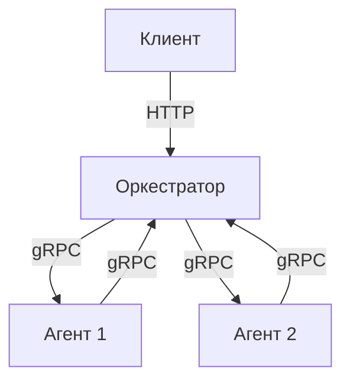

# Calculator

## Архитектура



## Установка и запуск

### 1. Клонирование репозитория

```bash
git clone https://github.com/lollmark/digital_calc.git
cd Calculator
```

### 2. Требования

- Go 1.20+
- Docker и Docker Compose (опционально)

### 3. Запуск оркестратора

**Linux/macOS:**
```bash
export TIME_ADDITION_MS=200
export TIME_SUBTRACTION_MS=200
export TIME_MULTIPLICATIONS_MS=300
export TIME_DIVISIONS_MS=400

go run ./cmd/orchestrator/main.go
```

**Windows PowerShell:**
```powershell
$env:TIME_ADDITION_MS=200
$env:TIME_SUBTRACTION_MS=200
$env:TIME_MULTIPLICATIONS_MS=300
$env:TIME_DIVISIONS_MS=400

go run .\cmd\orchestrator\main.go
```

### 4. Запуск агента

**Linux/macOS:**
```bash
export COMPUTING_POWER=4
export ORCHESTRATOR_URL="localhost:8080"

go run ./cmd/agent/main.go
```

**Windows PowerShell:**
```powershell
$env:COMPUTING_POWER=4
$env:ORCHESTRATOR_URL="localhost:8080"

go run .\cmd\agent\main.go
```

### 5. Запуск фронтенда

Откройте в браузере:

```
http://localhost:8081/
```

### 6. Запуск через Docker Compose (опционально)

```bash
docker-compose up --build
```

Если возникает ошибка `project name must not be empty`, выполните:

```bash
docker build -f Dockerfile.orchestrator -t orchestrator .
docker-compose up --build
```

## API (REST)

### POST /api/v1/calculate

Запускает вычисление выражения.

**Пример запроса:**
```http
POST /api/v1/calculate HTTP/1.1
Content-Type: application/json
Authorization: Bearer <token>

{"expression":"(2+3)*4-10/2"}
```

**Пример ответа (201 Created):**
```json
{"id": 1}
```

### GET /api/v1/expressions

Возвращает все выражения пользователя.

**Пример запроса:**
```http
GET /api/v1/expressions HTTP/1.1
Authorization: Bearer <token>
```

**Пример ответа (200 OK):**
```json
{
  "expressions": [
    {"id":1, "expression":"(2+3)*4-10/2", "status":"done", "result":15}
  ]
}
```

### GET /api/v1/expressions/{id}

Получение статуса и результата выражения по ID.

**Пример запроса:**
```http
GET /api/v1/expressions/1 HTTP/1.1
Authorization: Bearer <token>
```

**Пример ответа (200 OK):**
```json
{"expression": {"id":1, "status":"done", "result":15}}
```

## Примеры использования

### Простое выражение

```bash
curl -X POST http://localhost:8080/api/v1/calculate \
  -H "Content-Type: application/json" \
  -H "Authorization: Bearer $TOKEN" \
  -d '{"expression":"((3+5)*2-8)/4"}'

# {"id":1}

curl http://localhost:8080/api/v1/expressions/1 \
  -H "Authorization: Bearer $TOKEN"

# {"expression":{"id":1,"status":"done","result":2}}
```

### Ошибка деления на ноль

```bash
curl -X POST http://localhost:8080/api/v1/calculate \
  -H "Content-Type: application/json" \
  -H "Authorization: Bearer $TOKEN" \
  -d '{"expression":"10/(5-5)"}'

# HTTP 422: invalid expression or result out of range
```

### Тестирование

```bash
go test -v ./cmd/agent
```

## Переменные окружения

| Переменная             | Описание                                      | По умолчанию |
|------------------------|-----------------------------------------------|---------------|
| TIME_ADDITION_MS       | Задержка для операции + (в миллисекундах)     | 100           |
| TIME_SUBTRACTION_MS    | Задержка для операции -                       | 100           |
| TIME_MULTIPLICATIONS_MS| Задержка для операции *                       | 100           |
| TIME_DIVISIONS_MS      | Задержка для операции /                       | 100           |
| COMPUTING_POWER        | Количество потоков обработки у агента         | 100           |
| ORCHESTRATOR_URL       | Адрес gRPC-оркестратора (например, host:port) | localhost:8080 |

